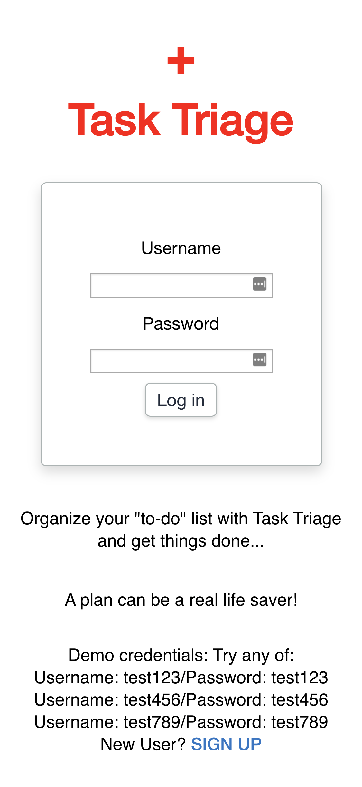
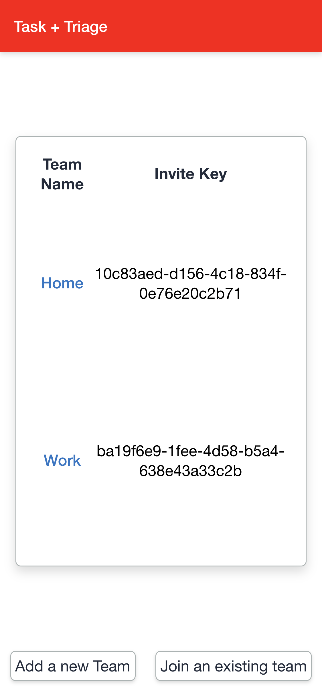
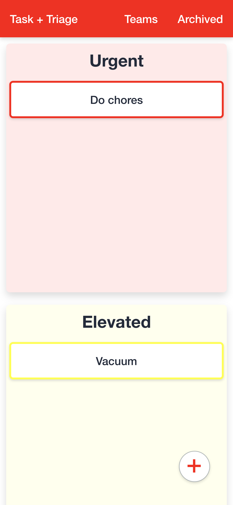
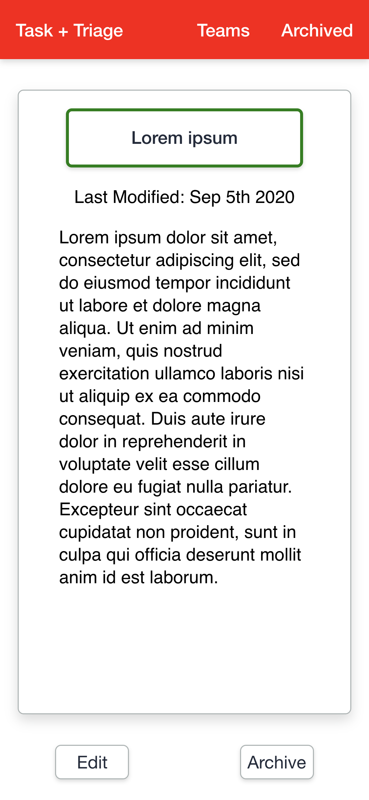
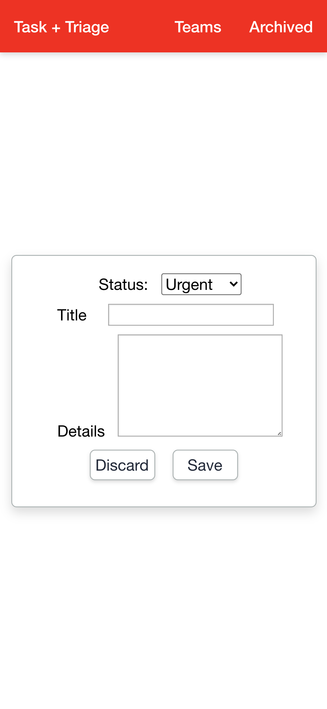
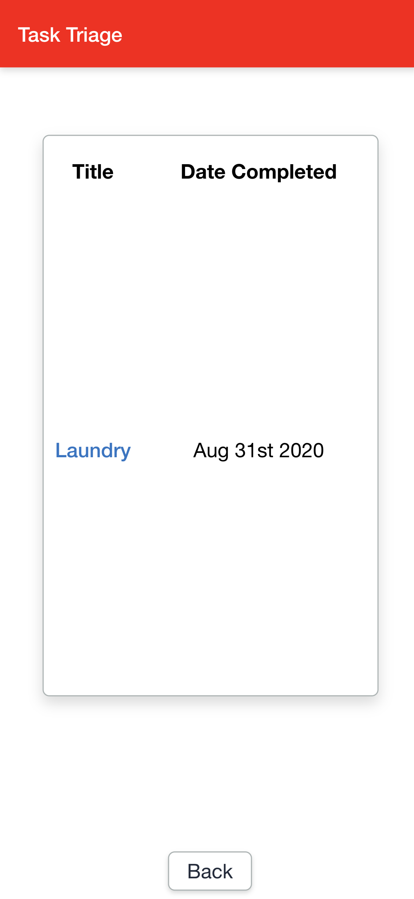
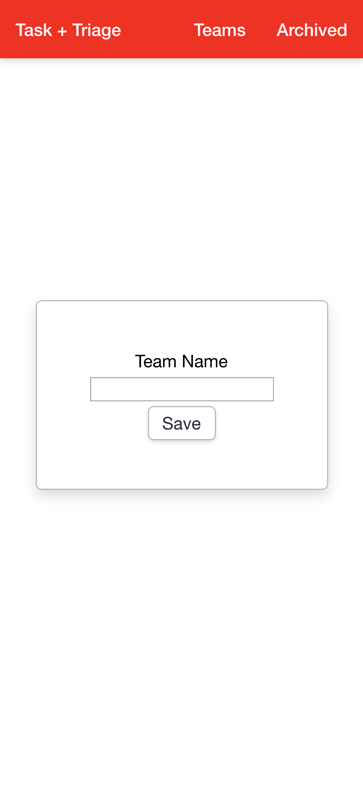

<!-- # Task Triage API-->
# Task Triage API

Task Triage is a task management/organization app with an emphasis on prioritizing tasks by their "status"/level of urgency. Task Triage's general theme and color-story draws inspiration from a medical triage and its tagging system. Task Triage allows users to share tasks with "teams" for collaboration, with access to any tasks that a user is a teammate of. Use Task Triage for personal or shared accountability and get things done!

## Motivation

My original thought and name for this app was “Tailor Triage”, as once again the purpose of this app is to streamline a process at my job in which I find myself stuck in the past. In this case, the scenario is picking up/dropping off alterations at the tailor. Since I work at a traditional haberdashery, we still handwrite alteration forms for the tailor to follow. In some cases, there are “rushes”--alterations that have to be completed by a specific date sooner than and outside of the usual workflow. The accountability for the tailoring to be completed on-time ends up falling on the person that marked up the alterations to communicate to the tailor, and it is up to that same person to keep stock of the dates for delivery to the client. Instead of relying on calendars and bulletin boards at work, I figured it could be fun to make an app that could help us keep one another apprised of priority alterations. I dropped the "tailor" aspect of the app and decided to keep the tasks/to-dos as open ended as possible to broaden appeal. As for the "triage" component... I was an EMT once upon a time, and I found the color-tagging system intuitive, which is especially important in situations of urgency. 

## Build Status

Version 1.0 is fully functional and ready for collaboration! A "teammate" with a unique team token can join an existing team and have access to its tasks, as well as edit them or create his/her own. Tasks can be "archived" when completed: In the event that a task needs to be restored I opted not to allow them to be deleted from the server, but I will look to implement deletion from the archived page with warnings that such an action is permanent. Of precedence next is real-time tracking of tasks and assigning due dates. It's not enough to just know which tasks are more important than others, there should be alerts and reminders when a task is about to bump up in urgency, or when an urgent task is dangerously due. Coming soon!

## Endpoints

* GET
    * `/api/teams` returns all teams that logged in user is a member of
    * `/api/teams/:teamId` returns all tasks that belong to a team
    * `/api/teams/:teamId/:taskId` returns task (only if user belongs to associated team)

* POST
    * `/api/auth/login` for login/authentication via JWT
    * `/api/users` to register as a new user
    * `/api/teams/join-team` to join an existing team with a valid and unique token (generated by UUID)
    * `/api/teams/new-team` to create a new team
    * `/api/teams/:teamId` to create a new task for a team

* PATCH 
    * `/api/teams/:teamId/:taskId` to update (or archive) an existing task

## Screenshots
Landing Page/Log In:



User's Teams:



Task Lists: 



Task Details:



Add/Edit Task: 



User's Archived Tasks:



Join/Add Team: 



## Built With

### Back-End
* Node and Express
    * Authentication via JWT
    * RESTful API
    * Unique tokens generated with UUID

### Testing
* Supertest (Integration)
* Mocha (Unit)
* Chai (Unit)

### Database
* Postgres
* Knex.js - SQL wrapper

### Production
* Deployed via Heroku

## Upcoming features
 
* DELETE: Delete a note `/api/teams/:teamId/:taskId`
* POST/PATCH: Ammend a due date to task object
* POST/GET: Send/Receive task alerts

## Demo

- [Live Demo](https://task-triage-client.vercel.app/)

## Getting Started

Major dependencies for this repo include Postgres and Node.

Clone this directory to your machine, `cd` into the directory and run `npm install` to load dependencies

Create dev and test databases: `createdb -U postgres -d tasktriage` and `createdb -U postgres -d tasktriage-test`

Create a `.env` file in the project root and include the following:

````
NODE_ENV=development
PORT=3000
DATABASE_URL="postgresql://postgres@localhost/tasktriage"
TEST_DATABASE_URL="postgresql://postgres@localhost/tasktriage-test"
JWT_SECRET="<your-secret-here>"
````

`npm run migrate` or `npm run migrate:test` to build/seed tables to respective database.

To test, run `npm t`

To start the server, `npm run dev`

This repository only contains the back-end server. To view the client code, see the repository below:

[https://github.com/StevieReyJuan/Task-Triage-Client](https://github.com/StevieReyJuan/Task-Triage-Client)

## Authors

* **S. Reyes** - Development

## Acknowledgments

* **Mario Mol** - My mentor